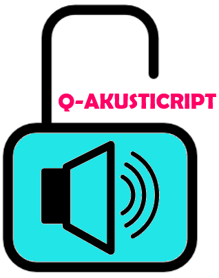

* * *

<!--Q-AKUSTICRIPT-->

### Establishing New Acoustic Cryptanalyses of AES-Based Block Cipher Using Low-Bandwidth Acoustic Emanations and Quranic Maqamat

As Muslims, we believe that the Quran is a complete Holy book of reference. In the field of acoustics, however, existing literatures have shown that most of the studies on acoustical elements in the Quran were focusing more on the recitation of the Quran rather than to delve into the textual analysis of acoustical elements in the text. In the field of cyber-security, so far no evidence has shown that AES-based block cipher is prone to side-channel attacks, such as using low bandwidth acoustic signals.

This project aim to develop a new model of Ontology of Maqamat of the Quran based on thematic content of the Quran, design the internal structure of AES-based block cipher on the acoustic patterns derived from Quranic maqamat and design acoustic profiles for both recorded Quranic maqamat and acoustic emanations.

| | |
| ---- | --- |
| **Status** | Current |
| **Lead** | Janatul Islah |
| **Members** | Ahmad Faizal Mohd Zain, Abu Bakar Hasan, Kamaruzzaman Seman, Azni Haslizan Ab. Halim, **Norazizi Sayuti**, Adnan Mohamed Yusoff, Robiatul Adawiyah, Hishomudin Ahmad, Ahmad Sanusi Azmi, Mohd Zaini Zakaria, Wan Azura Wan Ahmad |
| **Funded By** | MOHE (TRGS) |
| **Start Date** | 4/1/2016 |
| **End Date** | 4/1/2019 |

<a href="stegano">back</a> | <a href="intelligentdata">next</a> 

