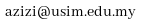

    <dl>
        <dt></dt>
        <dd> 
			

			Office: (+606) 798 6569 &#10;Email: &#10;<a href="http://fkab.usim.edu.my">Faculty of Engineering</a>&#10;<a href="http://usim.edu.my">Universiti Sains Islam Malaysia</a>
			

		</dd>
    </dl>     	

			
Azizi Sayuti is a senior lecturer at the [Faculty of Engineering and Built Environment](http://fkab.usim.edu.my), [Universiti Sains Islam Malaysia (USIM)](http://usim.edu.my). His current research interests include real-time systems, networks-on-chip, design space exploration, resource allocation and IoT, but he always keen to discuss about any open problems with potential Master or PhD candidates.

He graduated in Electronic Engineering from the [Shibaura Institute of Technology (SIT)](http://www.shibaura-it.ac.jp/en), Japan in 2001, under a Malaysian government scholarship. In 2004 he obtained a MSc in Computer Science from the [Universiti of Teknologi Malaysia (UTM)](http://kl.utm.my/), Malaysia. He completed his PhD research on [Design Space Exploration of Real-Time Networks-on-Chip](http://etheses.whiterose.ac.uk/8963/) at the [University of York](http://york.ac.uk) in 2015, under a sponsorship from the [Ministry of Higher Education](https://www.mohe.gov.my/). He joined Universiti Sains Islam Malaysia (USIM) in 2009 as a Lecturer. In 2016 he was promoted to Senior Lecturer. Since 2017 he holds a position as the Head of Electronic Engineering Department at the Faculty of Engineering and Built Environment, Universiti Sains Islam Malaysia.
