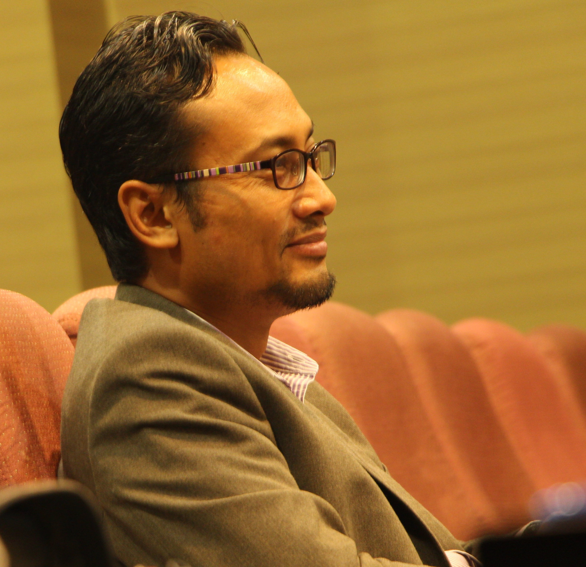

    <dl>
        <dt></dt>
        <dd> 
			

			<b>Dr. Norazizi Sayuti</b>
			P.Tech, SMIEEE &#10;Office: (+60)06-797 8612 &#10;Email:&#10;Faculty of Engineering and Built Environment &#10;Universiti Sains Islam Malaysia&#10;
			

		</dd>
    </dl>     	

Dr. Norazizi Sayuti is a senior lecturer at the <a href="https://fkab.usim.edu.my">Faculty of Engineering and Built Environment (FKAB)</a>, <a href="https://usim.edu.my">Universiti Sains Islam Malaysia (USIM)</a>. His current research interests include Embedded Systems, Cyber-Physical Systems, Real-Time Computing, Networks-On-Chip and Design Space Exploration, but he always keen to discuss about any open problems with potential Master or PhD candidates.

He graduated in Electronic Engineering from the <a href="https://www.shibaura-it.ac.jp/en">Shibaura Institute of Technology (SIT)</a>, Japan in 2001. He obtained a MSc in Computer Science from the <a href="https://kl.utm.my/">Universiti of Teknologi Malaysia (UTM)</a>, Malaysia in 2004. He completed his PhD research at the <a href="https://york.ac.uk">University of York</a> in 2015. He joined Universiti Sains Islam Malaysia (USIM) in 2009 as a Lecturer. In 2016 he was promoted to Senior Lecturer.

<!--He graduated in Electronic Engineering from the [Shibaura Institute of Technology (SIT)](https://www.shibaura-it.ac.jp/en), Japan in 2001. He obtained a MSc in Computer Science from the [Universiti of Teknologi Malaysia (UTM)](https://kl.utm.my/), Malaysia in 2004. He completed his PhD research on [Design Space Exploration of Real-Time Networks-on-Chip](https://etheses.whiterose.ac.uk/8963/) at the [University of York](https://york.ac.uk) in 2015. He joined Universiti Sains Islam Malaysia (USIM) in 2009 as a Lecturer. In 2016 he was promoted to Senior Lecturer. -->