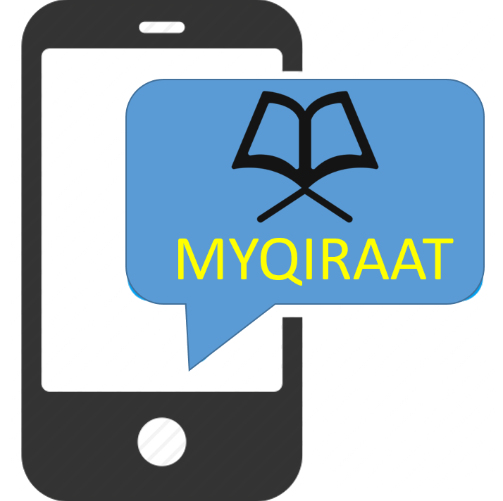

 

* * *
<!--MYQIRAAT-->

### The Design and Evaluation of An Interactive Qiraat Mobile Application

The process of learning Qiraat is challenging. Each Qiraat type has their own rules of recitation and variation; i.e. seven ahruf (style) for recitation. The seven modes (Qiraat Saba’ah) with seven narrators, called imam (reader) of Qiraat  and each imam have two rawis (students) of Qiraat recitation. The current practice of studying Qiraat often follows the traditional ways of learning using kitab (book) guided under a qualified teacher. The advancement of technology in education in particular the use of mobile devices, helps students to learn and comprehend knowledge using one-to-one interaction, such as in Qiraat learning. This project proposes an improvement to the previous versions of MyQiraat mobile application. 

| | |
| ---- | --- |
| **Status** | Current |
| **Lead** | Zulkifly Mohd Zaki |
| **Members** | **Norazizi Sayuti**, Khairul Annuar Mohamad, Muhammad Arif Musa |
| **Funded By** | USIM |
| **Start Date** | 14/12/2015 |
| **End Date** | 14/12/2017 |

<a href="intelligentdata">back</a> | <a href="latent">next</a> 

