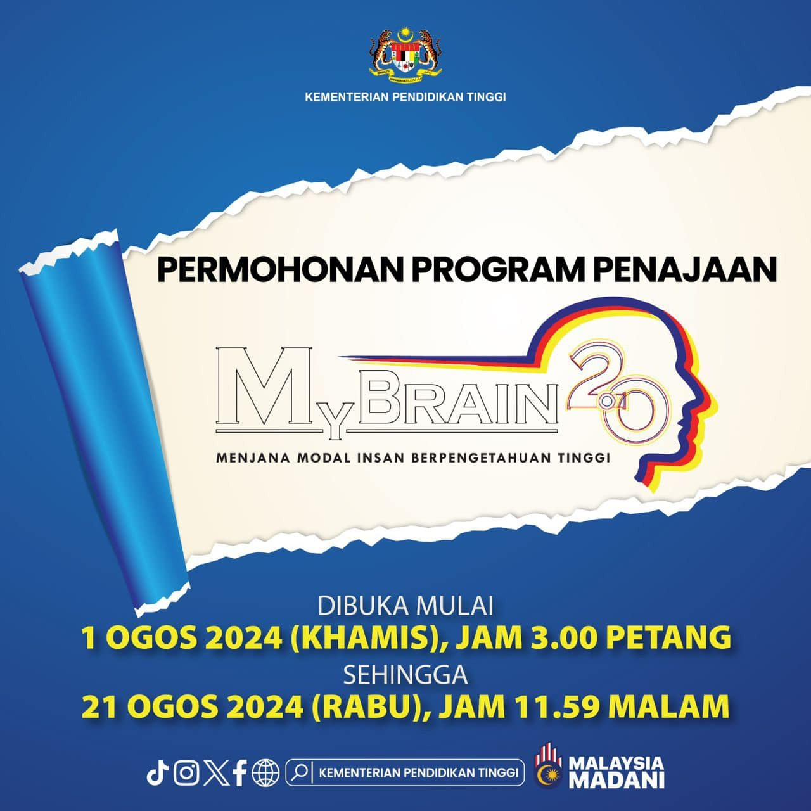
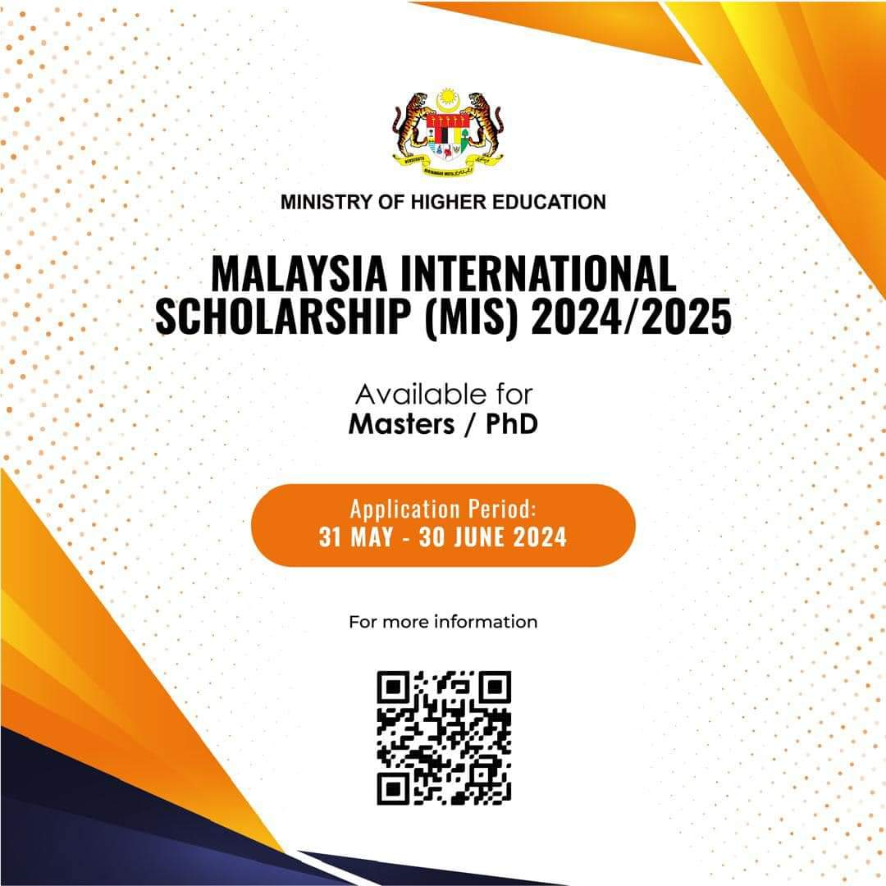

## Latest News
* * *
Last update on 02/08/2024.

Scholarships are available for local and international candidates to continue postgraduate study in Malaysia. If you're interested in the <a href="research">Research Topics</a>, drop me an email at () attached with your CV and a cover letter. 

* * *
### MyBRAIN 2.0

Program MyBRAIN 2.0 ditawarkan kepada orang awam yang tidak bekerja atau tidak berpendapatan tetap, dan pensyarah-pensyarah di Institusi Pendidikan Tinggi Swasta (IPTS) terpilih untuk melanjutkan pengajian di peringkat Ijazah Sarjana dan Ijazah Kedoktoran (PhD) di Institusi Pendidikan Tinggi (IPT) dalam negara. Pemilihan bidang adalah terdiri daripada bidang Sains, Teknologi, Kejuruteraan, Matematik (STEM) serta bidang Sains Sosial dan Sastera Ikhtisas. Untuk keterangan lanjut sila layari, 

<a href="https://biasiswa.mohe.gov.my/MyBrain2/">MyBRAIN 2.0.</a>

* * *
### MALAYSIA INTERNATIONAL SCHOLARSHIP (MIS)
 
Interested international graduates with outstanding academic and co-curricular backgrounds are welcome to apply for this scholarship to further their studies in leading Malaysian universities and higher education institutions with the opportunity to enjoy Malaysian hospitality and a world-class higher education experience.

* * *
### MALAYSIAN TECHNICAL COOPERATION PROGRAMME (MTCP)

The MTCP Scholarship is sponsored by the Malaysian government and dedicated to international students from developing countries to pursue their postgraduate studies in Malaysia, whilst at the same time acquire the necessary knowledge and skills that could contribute to the development of their country. The duration of the award is between 24 to 36 months for Master's Degree Programme.

<a href="https://mtcp.kln.gov.my/scholarship">Click here for details.</a>

<a href="blog-list">back</a> | <a href="./">next</a> 

