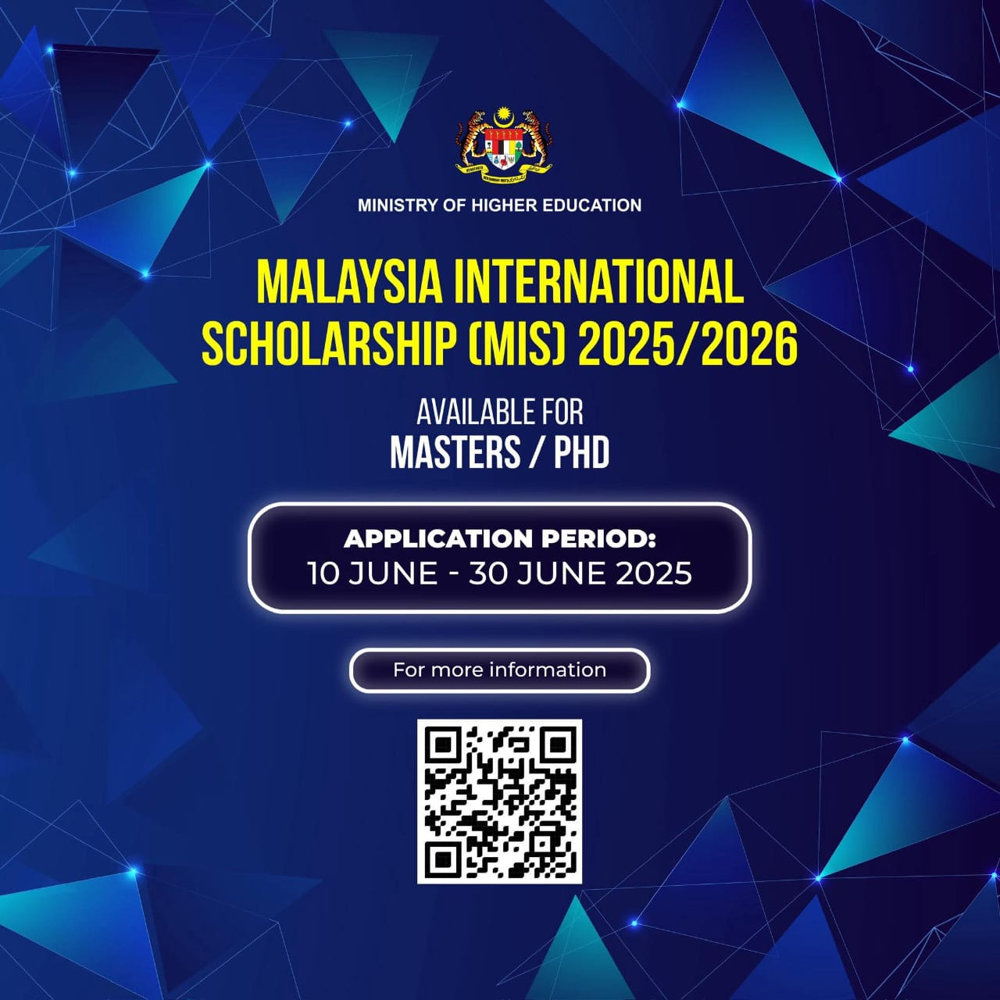

## Latest News
* * *
Last update on 10-01-2025.

Scholarships are available for local and international candidates to continue postgraduate study in Malaysia. If you're interested in the <a href="research">Research Topics</a>, drop me an email at () attached with your CV and a cover letter. 

* * *
### <a href="https://biasiswa.mohe.gov.my/INTER/">MALAYSIA INTERNATIONAL SCHOLARSHIP (MIS)</a> 
 
Interested international graduates with outstanding academic and co-curricular backgrounds are welcome to apply until 30 June 2025 to further their studies in leading Malaysian universities and higher education institutions with the opportunity to enjoy Malaysian hospitality and a world-class higher education experience.

* * *

### <a href="https://biasiswa.mohe.gov.my/MyBrain2/">MyBRAIN 2.0</a>

The MyBRAIN 2.0 Program is accepting applications until 8 May 2025. This scholarship is offered to members of the public who are unemployed or do not have a stable income, as well as lecturers at selected Private Higher Education Institutions (IPTS), to pursue studies at the Master's and Doctoral (PhD) levels at Higher Education Institutions (IPT) within the country. The fields of study include Science, Technology, Engineering, Mathematics (STEM), as well as Social Sciences and Professional Literature. 

* * *
### <a href="https://mtcp.kln.gov.my/scholarship">MALAYSIAN TECHNICAL COOPERATION PROGRAMME (MTCP)</a>
The MTCP Program is accepting applications until 18 June 2025. This scholarship is sponsored by the Malaysian government and dedicated to international students from developing countries to pursue their postgraduate studies in Malaysia, whilst at the same time acquire the necessary knowledge and skills that could contribute to the development of their country. The duration of the award is between 24 to 36 months for Master's Degree Programme.

<a href="blog-list">back</a> | <a href="./">next</a> 

