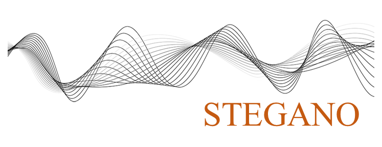

 

* * *
<!--STEGANO-->

### Evolutionary Multi-Objective Optimization for Cover Audio Selection in Audio Steganography

The security of data transfer is an ever-growing challenge because old methods can be compromised and defeated. In the past ten years, several methods were proposed in order to hide data inside an audio file. Most of the methods suffer from some limitations such as low capacity and low imperceptibility. When aiming to enhance the imperceptibility characteristics, the capacity may be decreased. On the contrary, when aiming to enhance the capacity characteristics, the imperceptibility may be decreased. Due to this tradeoff, it is crucial to find an algorithm that focused on both of these characteristics while considering to optimize the trade-offs between them. This intelligent algorithm aims to find optimal solution for each of the parameters involved in efficient embedding of audio steganography and find optimal tradeoffs between capacity and imperceptibility. 

| | |
| ---- | --- |
| **Status** | Current |
| **Lead** | Farida Hazwani Mohd Ridzuan |
| **Members** | **Azizi Sayuti**, Nurlida Basir, Madihah Mohd Saudi, Azni Haslizan, Sakinah Ali Pitchay |
| **Funded By** | MOHE (FRGS) |
| **Start Date** | 1/8/2017 |
| **End Date** | 1/8/2019 |

<a href="explorout">back</a> | <a href="akusticript">next</a> 

